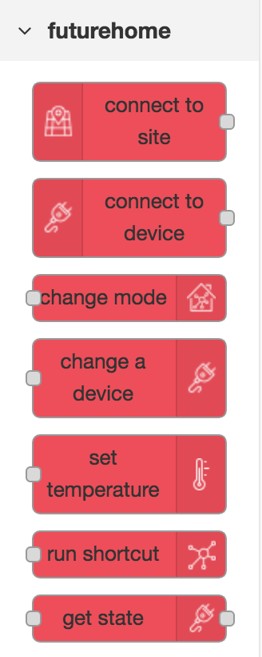

# node-red-contrib-futurehome


This module provides a set of nodes in Node-RED to controll a Futurehome system. This was made using Futurehome's public API.

## Install

To install the stable version use the `Menu - Manage palette` option and search for `node-red-contrib-futurehome`, or run the following command in your Node-RED user directory (typically `~/.node-red`):

	npm i node-red-contrib-futurehome

## Nodes
There are a total of 5 nodes. Two used for connecting to the system using websocket, three used for sending different commands to the system.





### connect to site
This node is used to connect to a Futurehome site, and output the data comming from the site. The data can be anything from a device changing state, a mode change, or the temperature setpoint in a room.


### connect to device
	There is currently a problem with the Futurehome API, so this node will not receive any data.
This node is used to connect to a device in the Futurehome system, and output changes from the device. This can be a magnet contact reporting open/close state, a motion sensor reporting motion, or a light turing on/off.


### change mode
This node is used to change between the 4 modes in Futurehome.
The mode can be defined on the node, or overwritten by payload.

```javascript
// Send the following payload to use the node.
msg.payload = {"mode":"home"};		// changes to home mode
msg.payload = {"mode":"away"};		// changes to away mode
msg.payload = {"mode":"sleep"};		// changes to sleep mode
msg.payload = {"mode":"vacation"};	// changes to vacation mode
```


### change a device
This node is used to change the state of a device. Dim or turn on/off a light.

```javascript
// Send the following payload to use the node.
// Turn device ON or OFF:
msg.payload = "on";			// turn on a device
msg.payload = "off";		// turn off a device
msg.payload = {"power":"on"};		// turn on a device
msg.payload = {"power":"off"};	// turn off a device
// Dim a device to %:
msg.payload = 35;		// dim a device to 35%
msg.payload = {"dimValue":"75"};	// dim a device to 75%
```


### run shortcut

This node is used to run a shortcut in the system.

```javascript
// Send the following payload to use the node.
// If msg.payload is an int the node will try to run the shortcut with that ID.
msg.payload = 3;		// will run shortcut with ID = 3

// Anything else will run the shortcut selected on the node.
```
